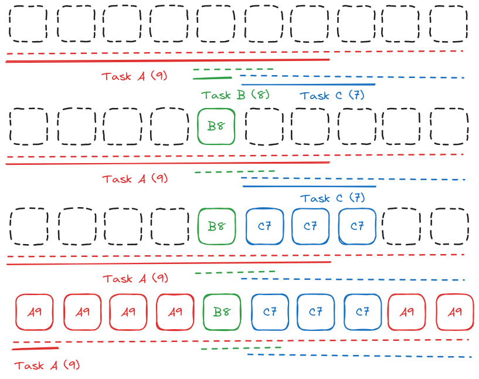
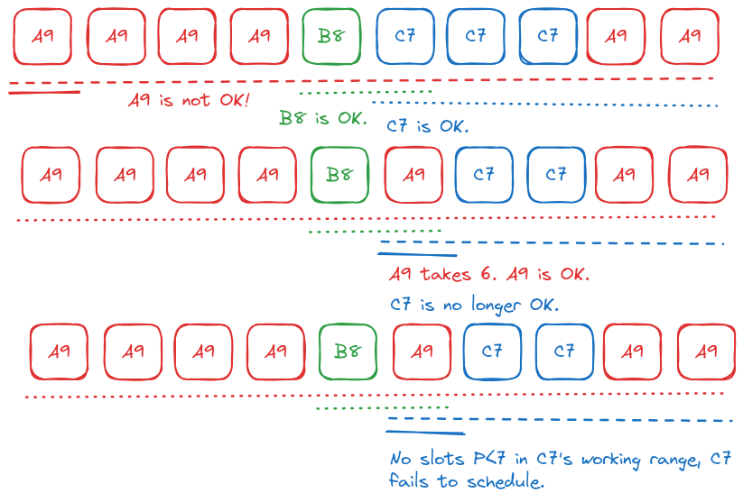

## Scheduling algorithm

1. Begin with the active periods, the parts of each day where you are willing to work, and divide them into cycles. Start at the present, and continue until the last task's due date.  
   
2. Next, a set of tasks; each task has an estimated time-to-completion, a start and due date, and a priority.
   
3. In ascending order of working-period-length, each task claims enough slots from the start of its working period to satisfy itself, if it can.
   
4. In ascending order of priority, each dissatisfied task tries to take slots in its working period, starting with the lowest-priority task. Repeat until none of the dissatisfied tasks can capture any slots.  
   (The algorithm for this is horribly slow, but this will only ever happen if you procrastinate long enough that you have to start triaging tasks.)  
   
   
## Shuffle

Tasks are randomized according to a modified Fisher-Yates shuffle, which runs for each slot from left to right.

1. Search for slots that would be legal in our position, starting at (and including) our position, ending at the end of our working period
   1. Empty slots are legal in any position
2. Choose a slot randomly from that list
3. Swap places with it, if we didn't pick ourselves.
